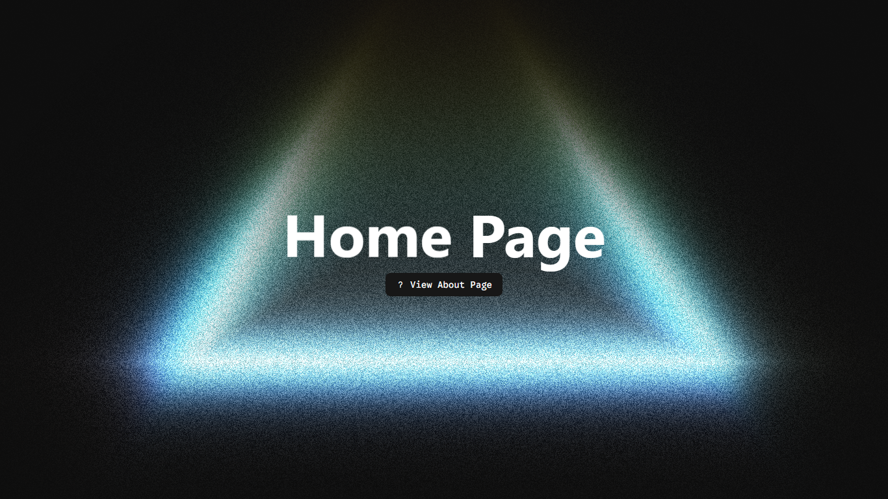

# Typical Env  

[](https://react.dev/)
[](https://vitejs.dev/)
[](https://tailwindcss.com/)
[](https://github.com/lukeed/clsx)
[](https://github.com/dcastil/tailwind-merge)
[](https://reactrouter.com/)
[](https://boxicons.com/)
[](https://michalsnik.github.io/aos/)
[](https://ui.shadcn.com/)
[](https://reactbits.dev/)
[](https://opensource.org/licenses/MIT)
[](https://github.com/typical-developer/Typical-Env)
[](https://github.com/typical-developer)

---

### Why Typical Env?
I built this template to eliminate the repetitive setup process I go through each time I start a new project.  
It saves time and ensures consistency in my development environment.

---

### What is it?
A template for my default development environment.

---

### What does it do?
It saves the time I usually spend setting up my default development environment.

---

### What does it contain?

| Technology | Description |
|-------------|--------------|
| **React** | JavaScript library for building user interfaces |
| **Vite** | Next-generation frontend tooling |
| **Tailwind CSS** | Utility-first CSS framework |
| **CLSx** | Utility for constructing className strings conditionally |
| **Tailwind Merge** | Intelligent merge for Tailwind CSS classes |
| **React Router** | Declarative routing for React |
| **React Router DOM** | DOM bindings for React Router |
| **Boxicons** | Icon library |
| **CSS AOS Library** | Animate On Scroll library |
| **Shadcn UI** | Reusable, accessible components built with Radix and Tailwind |
| **React Bits** | Reusable UI/UX React components and hooks |

---

### How to Use?

Clone the repository:
```bash
git clone https://github.com/typical-developer/Typical-Env.git
cd Typical-Env
npm install
npm run dev
```

---

###  Preview

Here's a quick look at the development environment setup:

<p align="center">
  
</p>

<p align="center">
  <a href="https://typical-env.vercel.app/" target="_blank">
    
  </a>
</p>

---

### ⭐ Support & Contribute

If you find this project useful, consider supporting it by giving it a **star** ⭐  
and **forking** 🍴 the repository to make it even better!

<p align="center">
  <a href="https://github.com/typical-developer/Typical-Env/fork" target="_blank">
    
  </a>
  &nbsp;
  <a href="https://github.com/typical-developer/Typical-Env" target="_blank">
    
  </a>
</p>
